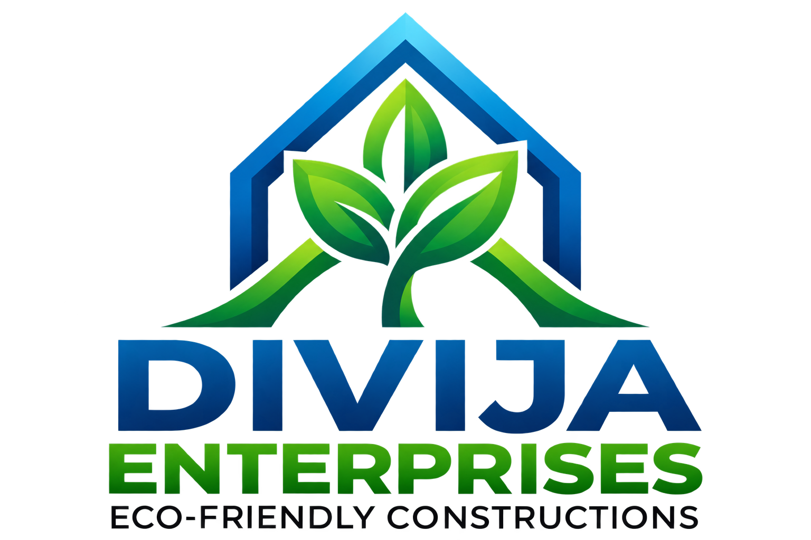

# Divija Enterprises — Eco-Friendly Construction & Infrastructure

A modern, responsive landing page for **Divija Enterprises**, an eco-friendly civil construction and materials supply company founded and led by **M. Sudharshan**.



> *"Building a sustainable future today, for a greener tomorrow."*  
> *"Nature is not a place to visit, it is home. We build with respect for it."* — **M. Sudharshan**

---

## 🌿 Technical Stack

- **Framework**: [Next.js](https://nextjs.org/) (App Router, React 19, TypeScript)
- **Styling**: [Tailwind CSS v4](https://tailwindcss.com/) with subtle architectural CAD grid background designs
- **State & Data Fetching**: Latest [TanStack Query (@tanstack/react-query v5)](https://tanstack.com/query/latest)
- **Animations**: [Framer Motion](https://www.framer.com/motion/) (Continuous loaded eco-lorry driving animation, rotating hero synonyms)
- **Icons**: [Lucide React](https://lucide.dev/)

---

## 🏗️ Core Features

1. **Header & Navigation**:
   - Official Divija Eco Construction logo.
   - Smooth navigation links with mobile drawer support.
   - Quick inquiry action and direct contact micro-bar.

2. **Hero Section**:
   - High-impact headline with smooth animated rotating eco synonyms (*Sustainable Future*, *Greener Tomorrow*, *Cleaner Legacy*, *Resilient Habitat*, *Net-Zero World*, *Eco-Conscious Era*).
   - Eco-friendly quotation callout.
   - Call-to-action buttons (*Get a Quote*, *Our Services*, *Talk to an Expert*).

3. **Continuous Lorry Animation**:
   - Detailed Framer Motion-animated loaded tipper lorry with "Divija Enterprises - Eco Logistics" branding.
   - Real-time rotating multi-axle wheels, clean dust trail, and road stripes moving animation over an asphalt roadbed with solar/wind silhouettes.

4. **9 Specialized Service Divisions**:
   - **Electric works**: High-efficiency cabling, solar grid integration, industrial distribution.
   - **Civil works**: Eco-concrete foundations, rainwater harvesting structures, commercial buildings.
   - **Road works**: Permeable pavements, eco-asphalt paving, highway grading.
   - **Building materials supply**: Fly-ash bricks, AAC blocks, green-certified cements.
   - **Machinery procurement**: Low-emission hydraulic excavators, road rollers, cranes.
   - **Transport**: GPS-monitored heavy tippers, route-optimized low-carbon haulage.
   - **Manpower supply**: Certified civil engineers, safety supervisors, skilled labor.
   - **Sand Supply**: Triple-washed M-Sand & P-Sand preserving natural riverbeds.
   - **Metal supply**: Fe 550D earthquake-resistant TMT rebars, structural steel girders.

5. **About / Founder Section**:
   - Highlighting company leadership: **Founded and led by M. Sudharshan**.
   - Founder's statement, core sustainability pillars, and trust credentials.

6. **Contact Form with TanStack Query**:
   - Reactive quote request form powered by `useMutation` with loading states, error handling, and animated confirmation feedback.
   - Backed by Next.js API route (`/api/contact`).
   - Company headquarters placeholders (Address, Phones, Email, Working Hours).

---

## 🚀 Getting Started

```bash
# Clone the repository
git clone https://github.com/rapoleramsai4/divija-enterprises.git
cd divija-enterprises

# Install dependencies
npm install

# Start development server
npm run dev

# Or build for production
npm run build
npm run start
```

Open [http://localhost:3000](http://localhost:3000) to view the site.

---

## 📄 License

Copyright © 2026 Divija Enterprises. All rights reserved. Founded & led by M. Sudharshan.
